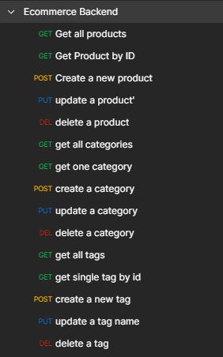
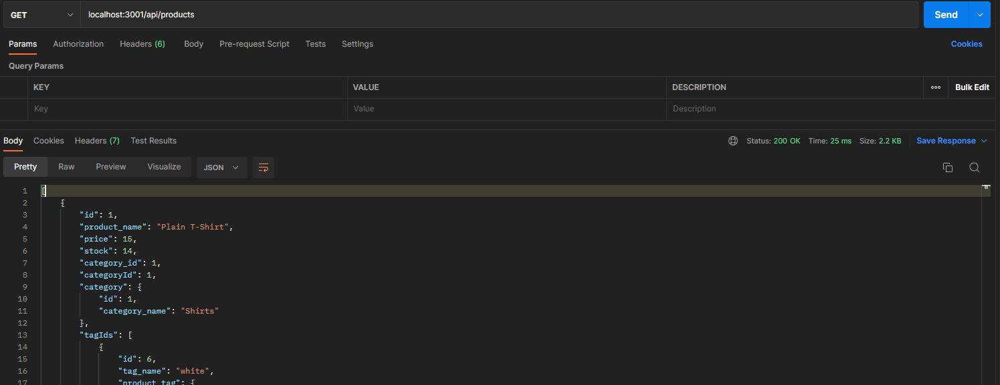

# E-commerce Backend using Sequelize


## Description

Given a functional Express.js API, I built upon it further by creating all the Models (using Sequelize), syncing it to a database, and creating all the missing routes. The endpoints /api/products, /api/tags, and /api/categories are responsive to all CRUD actions.



Project put together using the following libraries/packages:

- [Sequelize](https://sequelize.org/)
- [Express.js](https://expressjs.com/)
- [dotenv](https://www.npmjs.com/package/dotenv)

The following images come from [POSTMAN](https://www.postman.com/)

## Preview



## Table of Contents

- [Installation](#installation)
- [License](#license)
- [Questions](#questions)

## Installation

1. Create the database in MySQL workbench using the schema that's found in the db folder

2. Setup the database connection now. Create a .env file and put the following code in it. However replace the contents of DB_USER and DB_PASSWORD to match your MySQL workbench information. (ex. 'root' and 'coolpassword123')

```
DB_NAME='ecommerce_db'
DB_USER='<your_user_here>'
DB_PASSWORD='<your_password_here>'
```

3. Once the database has been made, it's time to seed it with data. Return to your terminal (make sure you are in this projects working directory) and run the command:

```
npm run seed
```

4. After database has been seeded, it's time to run the server running the command:

```
node server.js
```

5. Navigate to POSTMAN, and start testing any endpoints for GET, POST, PUT and DELETE

```
localhost:3001/api/products
localhost:3001/api/products{id}
localhost:3001/api/categories
localhost:3001/api/categories/{id}
localhost:3001/api/tags
localhost:3001/api/tags/{id}
```

## License

[](https://choosealicense.com/licenses/mit/)

For more information about the licensing of this project, please click on the badge above, or follow this link https://choosealicense.com/licenses/mit/

## Questions

How to get into contact with me?

[My Github Profile](https://github.com/Jon-Ledo)

Email : jonledo.code@gmail.com
